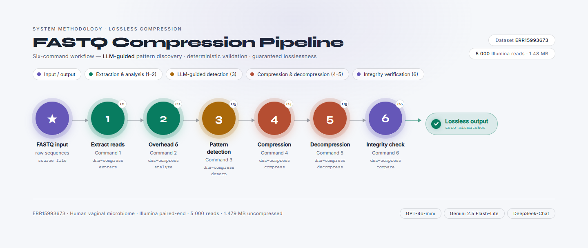

# DNA Compression With LLM

A lossless DNA sequence compression workflow. It extracts sequence lines from
FASTQ files, finds repetitive motifs with hosted or local models, stores the
selected patterns in JSON, replaces those patterns with tokens, and restores
the original sequence file from the same dictionary.

The project ships as an installable package with one command-line interface:
`dna-compress`.

## Requirements

- Python 3.10 or 3.11
- [uv](https://docs.astral.sh/uv/)

## Install

The core utilities use only the standard library:

```powershell
uv sync
uv run dna-compress --help
```

Install optional dependencies only for the detection providers you use:

```powershell
uv sync --extra llm
uv sync --extra local-models
uv sync --all-extras
```

| Extra | Includes |
| --- | --- |
| `llm` | OpenAI-compatible clients, DeepSeek, and Google Gemini |
| `local-models` | CUDA 12.1 PyTorch on supported Windows/Linux systems, CPU PyTorch elsewhere, Transformers, DNABERT-2, and HyenaDNA dependencies |

`pyproject.toml` and `uv.lock` are the project's dependency source of truth.
There is no maintained `requirements.txt` file.

## Testing

The test suite covers offline workflows and simulated providers, so it does
not require an API key or model download:

```powershell
uv sync --group test
uv run --locked --group test pytest
```

GitHub Actions runs this suite on Ubuntu with Python 3.10 on every push and
pull request.

## Commands

Run all commands as `uv run dna-compress <command>`:

| Command | Purpose |
| --- | --- |
| `detect` | Create a pattern dictionary with a hosted or local model |
| `compress` | Replace dictionary sequences with tokens |
| `decompress` | Restore a compressed sequence file |
| `analyze` | Sweep dictionary-overhead estimates without calling a model |
| `extract` | Extract sequence lines from FASTQ or FASTQ.GZ |
| `generate` | Generate synthetic FASTQ data |
| `compare` | Compare normalized sequence files |
| `benchmark` | Compare gzip, bzip2, and LZMA on an input file |

Use `uv run dna-compress <command> --help` for the full argument list.

## Demo Video

Watch the [pipeline demonstration](docs/demo/dna-compression-pipeline-demo.mp4)
for an end-to-end run of the workflow below.

## FASTQ Compression Pipeline



This example processes a public FASTQ read through sequence extraction,
pattern detection, lossless compression, restoration, and byte-level
integrity verification. It uses the forward read from
[`ERR15993673`](https://trace.ncbi.nlm.nih.gov/Traces/?view=run_browser&acc=ERR15993673).
Raw sequencing files are downloaded on demand because they are too large to
include in the repository. Docker Desktop must be running for the DNABERT-2
steps; the first image build downloads the model and requires an internet
connection. Run each command after the preceding step completes.

### 1. Install dependencies

```powershell
uv sync
```

### 2. Create the input directory

```powershell
New-Item -ItemType Directory -Force .\fastq_files\input | Out-Null
```

### 3. Download the FASTQ input

```powershell
curl.exe --fail --location "https://ftp.sra.ebi.ac.uk/vol1/fastq/ERR159/073/ERR15993673/ERR15993673_1.fastq.gz" --output .\fastq_files\input\ERR15993673.fastq.gz
```

### 4. Verify the downloaded file

```powershell
(Get-FileHash .\fastq_files\input\ERR15993673.fastq.gz -Algorithm MD5).Hash
```

Expected MD5: `36005C9FA104ECFF3390F59F92EA9EBE`.

### 5. Extract 5,000 sequence lines

```powershell
uv run dna-compress extract --input .\fastq_files\input\ERR15993673.fastq.gz --output .\data\runs\ERR15993673_5000.seq.txt --n 5000
```

### 6. Estimate dictionary overhead

```powershell
uv run dna-compress analyze --file .\data\runs\ERR15993673_5000.seq.txt
```

### 7. Build the local-model image

```powershell
docker build -t dna-patterns .
```

### 8. Detect patterns with DNABERT-2

Use this command when no NVIDIA GPU is available to Docker:

```powershell
docker run --rm -v "${PWD}\data:/data" --entrypoint dna-compress dna-patterns detect -f /data/runs/ERR15993673_5000.seq.txt -o /data/outputs/ERR15993673_5000_dnabert2_patterns.json -p dnabert2 -b 80 --overhead 101
```

Optional CUDA acceleration: when Docker can access an NVIDIA GPU, use this
command instead:

```powershell
docker run --rm --gpus all -v "${PWD}\data:/data" --entrypoint dna-compress dna-patterns detect -f /data/runs/ERR15993673_5000.seq.txt -o /data/outputs/ERR15993673_5000_dnabert2_patterns.json -p dnabert2 -b 80 --overhead 101
```

### 9. Compress the sequences

```powershell
docker run --rm -v "${PWD}\data:/data" --entrypoint dna-compress dna-patterns compress -i /data/runs/ERR15993673_5000.seq.txt -p /data/outputs/ERR15993673_5000_dnabert2_patterns.json -o /data/outputs/ERR15993673_5000_dnabert2.compress
```

### 10. Restore the sequences

```powershell
docker run --rm -v "${PWD}\data:/data" --entrypoint dna-compress dna-patterns decompress -i /data/outputs/ERR15993673_5000_dnabert2.compress -p /data/outputs/ERR15993673_5000_dnabert2_patterns.json -o /data/outputs/ERR15993673_5000_dnabert2.restored
```

### 11. Compare normalized sequence content

```powershell
uv run dna-compress compare .\data\runs\ERR15993673_5000.seq.txt .\data\outputs\ERR15993673_5000_dnabert2.restored
```

### 12. Compare output sizes

```powershell
Get-Item .\data\runs\ERR15993673_5000.seq.txt, .\data\outputs\ERR15993673_5000_dnabert2.compress, .\data\outputs\ERR15993673_5000_dnabert2.restored | Select-Object Name, Length
```

### 13. Verify lossless restoration

```powershell
$originalHash = (Get-FileHash .\data\runs\ERR15993673_5000.seq.txt -Algorithm SHA256).Hash
$restoredHash = (Get-FileHash .\data\outputs\ERR15993673_5000_dnabert2.restored -Algorithm SHA256).Hash
if ($originalHash -ne $restoredHash) { throw "Restoration did not preserve the original file" }
"Restoration is byte-identical: True"
```

The paired reverse read is available as `ERR15993673_2.fastq.gz`; download it
from the same ENA directory and change the input and output names if you want
to process it instead. The `extract` command automatically handles both
`.fastq` and `.fastq.gz` input.

`compare` intentionally keeps the original whitespace-tolerant behavior, so
the SHA-256 comparison above is the strict losslessness check.

## Detection Providers

| Provider | Extra | API key | Default model |
| --- | --- | --- | --- |
| `chatgpt` | `llm` | Required | `gpt-4o-mini` |
| `deepseek` | `llm` | Required | `deepseek-chat` |
| `gemini` | `llm` | Required | `gemini-2.5-flash-lite` |
| `dnabert2` | `local-models` | Not required | `zhihan1996/DNABERT-2-117M` |
| `hyenadna` | `local-models` | Not required | `LongSafari/hyenadna-large-1m-seqlen-hf` |

Local models download their weights the first time they run. DNABERT-2 and
HyenaDNA retain their existing `trust_remote_code=True` behavior, so use the
locked optional environment supplied by this repository.

### CUDA acceleration

The local `dnabert2` and `hyenadna` providers automatically use CUDA when the
installed PyTorch build can see an NVIDIA GPU. They use CPU when CUDA is not
available, including when a CUDA transfer fails. On Windows `AMD64` and Linux
`x86_64`, the `local-models` extra installs the CUDA 12.1 PyTorch build; other
platforms use the CPU build.

For Docker, the optional CUDA command in step 8 requires `--gpus all` and an
NVIDIA GPU accessible to Docker. Omit that flag when Docker cannot access a
GPU; the provider then uses CPU. The detection log reports whether the model
loaded on CUDA or CPU.

## Docker

The Docker image installs every locked optional dependency, pre-downloads
DNABERT-2, and starts at `dna-compress detect` by default. The workflow above
uses the image for detection, compression, and decompression.

```powershell
docker build -t dna-patterns .
docker run --rm --entrypoint dna-compress dna-patterns --help
```

The container writes logs under the mounted `/data/logs` directory. Set
`DNA_COMPRESSION_LOG_DIR` for a different log directory outside Docker.

## Project Layout

| Location | Purpose |
| --- | --- |
| `dna_compression/` | Reusable library modules and command dispatcher |
| `dna_compression/detection/` | Provider clients, local-model helpers, and detection pipeline |
| `data/input/` | Extracted sequence input files |
| `data/outputs/` | Pattern JSON, compressed files, and restored files |
| `data/logs/` | Command logs |
| `docs/architecture.md` | Module ownership and deliberate compatibility boundaries |

See [docs/architecture.md](docs/architecture.md) for the package structure and
known scope boundaries.

## Notes

- The pattern JSON produced by `detect` must be retained for decompression.
- Hosted model output can vary over time, even when a temperature setting is
  fixed. Once a pattern JSON is saved, compression and decompression are
  deterministic.
- The detector's savings estimate and the overhead diagnostic use different
  token-cost assumptions.
- The bundled test data is from `ERR15993673`, a raw metagenomic sequencing
  data set from a human vaginal sample in the NCBI Trace Archive.
